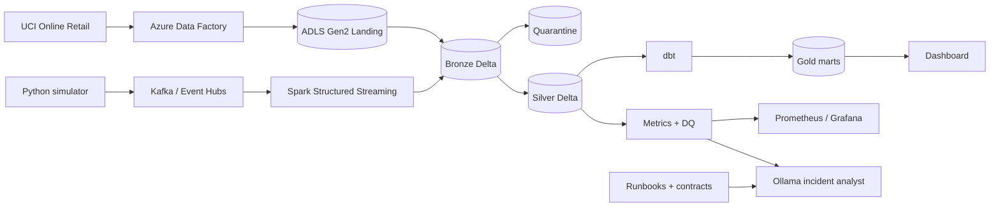

# RetailPulse

**A real-time Azure retail data platform for batch and streaming analytics, data quality,
observability, and AI-assisted incident response.**

RetailPulse is deliberately scoped as a seven-day portfolio build. Its local path is fully
runnable without cloud credentials; the same contracts, medallion boundaries, checkpoints,
Delta MERGE pattern, dbt models, and operational controls are represented in the Azure assets.

## Project reference

- [Requirements and acceptance criteria](docs/requirements.md)
- [Architecture and design decisions](docs/architecture.md)
- [Key features](docs/key-features.md)
- [Built vs. remaining status](docs/project-status.md)
- [Stage-wise completion plan](docs/execution-plan.md)
- [Repeatable demo guide](docs/demo-guide.md)
- [Documentation index](docs/README.md)

## 1. Business problem

Retail teams need historical sales reporting and live behavioral/inventory signals in one
trusted platform. The difficult part is not drawing a chart—it is handling replayed, late, or
malformed events without silently corrupting metrics. RetailPulse preserves raw input, validates
contracts, deduplicates by event ID, quarantines bad data, records every run, and explains
detected incidents.

## 2. Architecture



The local demo replaces ADLS/Delta with append-only JSONL and SQLite so it starts in seconds.
The production jobs in [`databricks/`](databricks) use Spark, Delta, watermarks, checkpoints,
Kafka offsets, quarantine, and `MERGE`.

## 3. Technology stack

| Layer | Local | Azure |
|---|---|---|
| Ingestion | Python, file-backed stream | ADF, Event Hubs Kafka endpoint |
| Stream broker | Redpanda (Kafka API) | Azure Event Hubs |
| Processing | Python reference implementation | Databricks PySpark / Structured Streaming |
| Storage | JSONL + SQLite + DuckDB | ADLS Gen2 + Delta Lake |
| Transformation | dbt Core / DuckDB | dbt + Databricks SQL |
| Monitoring | Prometheus + Grafana | Azure Monitor + audit Delta tables |
| Incident analysis | Rules, optional Ollama | Ollama or an approved hosted model |
| Infrastructure | Docker Compose | Terraform / AzureRM |

## 4. Quick start

Prerequisites: Python 3.11–3.13 (3.11 recommended) and, for Kafka/monitoring, Docker. dbt 1.9's
serialization dependency does not yet support Python 3.14; the Docker and CI paths use 3.11.

```bash
python -m venv .venv
source .venv/bin/activate
pip install -e '.[dev,analytics]'
cp .env.example .env
python scripts/run_demo.py
```

The demo generates healthy traffic, processes Bronze → Silver, builds local Gold marts, injects
duplicates, emits a DQ alert, and writes an incident report. Generated artifacts live in `data/`.

For individual scenarios:

```bash
retailpulse init
retailpulse produce --count 100 --scenario normal --seed 42
retailpulse process
retailpulse produce --count 60 --scenario duplicate --seed 7
retailpulse process --ollama
retailpulse status
```

Other scenarios are `late-data`, `malformed`, and `traffic-spike`. File-backed streaming is the
default. To publish to Kafka, install `.[kafka]`, start Redpanda, and set
`KAFKA_ENABLED=true`. Kafka publishing enables idempotence.

## 5. Dataset and batch path

Download the [UCI Online Retail dataset](https://archive.ics.uci.edu/dataset/352/online+retail),
export the workbook as CSV, then normalize it:

```bash
python scripts/prepare_uci.py Online_Retail.csv --output data/landing/uci
```

This creates `customers`, `products`, `orders`, and `order_items` JSONL files. The ADF template
in [`azure/adf/uci_to_adls.pipeline.json`](azure/adf/uci_to_adls.pipeline.json) lands the source;
[`databricks/batch_bronze_silver.py`](databricks/batch_bronze_silver.py) performs typed Bronze and
Silver processing. ADLS uses:

```text
landing/  bronze/  silver/  gold/  checkpoints/  quarantine/
```

## 6. Streaming and medallion behavior

Three topics keep the first version understandable:

- `customer-events`: product views, searches, cart additions
- `order-events`: checkout, purchase, payment
- `inventory-events`: inventory updates

Every event has a UUID, event and ingestion timestamps, a strict schema version, and relevant
business identifiers. Bronze is immutable and includes transport/audit metadata. Silver applies:

- strict schema and business-rule validation;
- `event_id` deduplication before Delta MERGE;
- a 30-minute event-time watermark;
- quarantine of malformed and late records;
- checkpointed offsets for restart safety.

The local processor persists a line offset per topic and a durable processed-event registry.
Normal checkpoint continuation and idempotent reruns are tested. Because the offset file and
SQLite commit are not one atomic transaction, abrupt process-loss fault injection remains before
claiming exactly-once behavior for this local adapter; Delta checkpoints are the production path.

## 7. dbt and Gold data model

The dbt project follows `staging → intermediate → marts` and builds:

- `dim_customer`, `dim_product`, and `dim_date`;
- `fact_orders` and `fact_order_items`;
- `daily_sales`, `customer_360`, and `inventory_health`;
- an SCD Type 2 product snapshot based on price changes.

Run it after the demo:

```bash
dbt build --project-dir dbt --profiles-dir dbt
dbt docs generate --project-dir dbt --profiles-dir dbt
```

Tests cover unique and non-null keys, accepted event types, relationships, positive quantity,
non-negative prices, and non-negative order totals.

## 8. Dashboard

```bash
streamlit run dashboard/app.py
# or: docker compose --profile dashboard up dashboard
```

The dashboard shows revenue, orders, average order value, conversion rate, country sales,
pipeline history, rejected/duplicate/late counts, and active alerts. It reads the local SQLite
mart; Databricks SQL or Power BI can point at the equivalent Gold Delta tables in Azure.

## 9. Monitoring and failure simulation

Each run records status, duration, counts read/written/rejected/duplicate/late, and calculated
rates. Alerts fire when duplicate rate exceeds 5%, rejection rate exceeds 2%, or late-event rate
exceeds 5%. Prometheus textfile metrics and a provisioned Grafana dashboard are included.

```bash
docker compose up -d prometheus node-exporter grafana
# Grafana: http://localhost:3000 (admin / retailpulse)
# Prometheus: http://localhost:9090
```

The latest machine-readable state is `data/metrics/latest.json`; bad payloads and their reasons
are in `data/quarantine/events.jsonl` and the SQLite `quarantine` table.

## 10. AI DataOps assistant

Incident generation always has a deterministic, evidence-only fallback. With Ollama enabled it
sends only current run statistics and triggered alerts to the configured local model:

```bash
docker compose up -d ollama
docker compose exec ollama ollama pull llama3.2:3b
retailpulse process --ollama
```

Reports are written to `data/incidents/`. Runbooks in [`docs/runbooks/`](docs/runbooks) document
operator checks for duplicates and malformed payloads. This keeps AI downstream of observable
facts; it does not decide whether data is valid.

## 11. Azure deployment

Authenticate with Azure CLI, review names/region/costs, then:

```bash
cd terraform
terraform init
terraform plan -var-file=example.tfvars
terraform apply -var-file=example.tfvars
```

Terraform provisions a resource group, hierarchical-namespace storage, three Event Hubs, Data
Factory, Databricks, and Key Vault. It does **not** deploy compute clusters or run pipelines,
avoiding surprise compute spend. After provisioning:

1. Create ADLS directories and grant the ADF/Databricks managed identities least-privilege roles.
2. Import the ADF pipeline and configure its HTTP and ADLS linked datasets.
3. Upload the two Databricks jobs, replace the `ACCOUNT` widget default, and use Key Vault-backed
   secrets for Event Hubs SAS or managed identity where supported.
4. Set the streaming job checkpoint location once and never share it between queries.
5. Point dbt's Databricks adapter at the Silver catalog and schedule Gold builds after Silver.

Never commit `.tfvars`, connection strings, SAS keys, or Databricks tokens.

## 12. CI/CD and validation

GitHub Actions runs Ruff, pytest with coverage, the end-to-end demo, dbt build/tests, SQLFluff,
Terraform formatting, and Terraform validation. Locally:

```bash
make lint
make test
docker compose config -q
terraform -chdir=terraform fmt -check
```

The test suite verifies contracts, scenario volumes, duplicate handling, checkpoint idempotency,
watermarking, quarantine, Gold materialization, metrics, and historical source normalization.

## 13. Repository map

```text
src/retailpulse/       contracts, simulator, local medallion pipeline, DQ, incident assistant
scripts/               clean demo and UCI normalization
databricks/            batch and Structured Streaming Delta jobs
dbt/                   staging, marts, snapshots, and tests
dashboard/             Streamlit business/operations dashboard
monitoring/            Prometheus and provisioned Grafana dashboard
azure/adf/             historical ingestion pipeline template
terraform/             core Azure infrastructure
docs/                  data contract and operational runbooks
tests/                 deterministic unit and end-to-end tests
```

## 14. Demo script

For a 5–10 minute walkthrough:

1. Show the architecture and strict v1 event contract.
2. Run `python scripts/run_demo.py`; open Silver, the audit log, and Gold summary.
3. Open the dashboard and show normal KPIs.
4. Highlight the injected duplicate rate and Grafana alert.
5. Open the generated incident report and trace its recommendation to the duplicate runbook.
6. Show the Databricks `foreachBatch` MERGE and dbt lineage/tests.
7. Finish with the green CI run and Terraform plan.

## Scope decisions

The first release intentionally has three topics, one event contract version, one SCD2 entity,
and one operational dashboard. Authentication UI, a schema registry, multi-region recovery, and
automatic quarantine replay are sensible later additions, but none is required to demonstrate
the core data-engineering flow safely.
