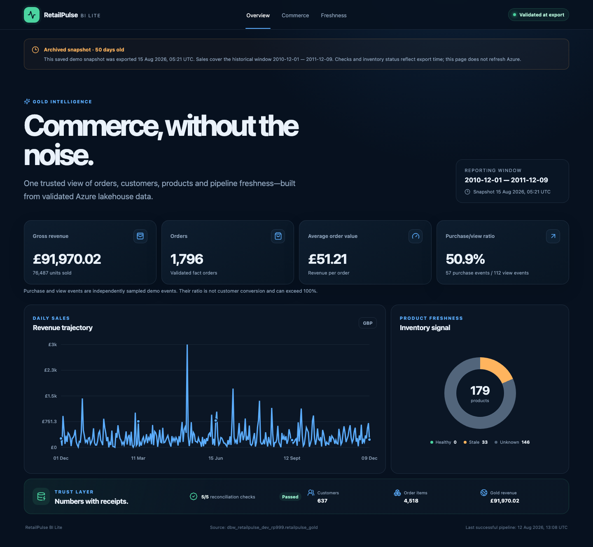
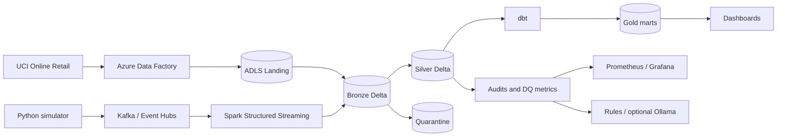

# RetailPulse

[](https://github.com/PK-999/retailpulse/actions/workflows/ci.yml)

A retail data engineering portfolio project covering batch ingestion, streaming, medallion
storage, dimensional modeling, data quality, observability, and infrastructure as code.

The local demo runs without Azure credentials. Azure integration results are recorded in
[verification evidence](docs/evidence/); [project status](docs/project-status.md) distinguishes
those historical proofs from checks performed on the current code.

[Portfolio dashboard](https://PK-999.github.io/retailpulse/) ·
[Watch the walkthrough](docs/portfolio-walkthrough.md) ·
[Reproduce the demo](docs/demo-guide.md) · [Release evidence](docs/evidence/local-e2e.json)



## What the project demonstrates

| DE capability | Implementation |
|---|---|
| Historical ingestion | UCI CSV normalization, parameterized ADF deliveries, bounded Databricks batch jobs |
| Streaming | Python simulator, Redpanda / Event Hubs, Spark Structured Streaming |
| Lakehouse processing | Landing → Bronze → Silver → Gold, Delta MERGE, checkpoints, deduplication |
| Contracts and data quality | Versioned events, business validation, quarantine, failure scenarios |
| Analytics engineering | dbt dimensions/facts, incremental marts, relationships, SCD Type 2 snapshot |
| Observability | Run audits, Prometheus metrics, provisioned Grafana dashboard, incident reports |
| Platform engineering | Terraform, managed identities, cost controls, Docker, GitHub Actions |
| Consumption | Local Streamlit dashboard and static React/TypeScript Azure Gold dashboard |

## Architecture



The fast local adapter uses JSONL and SQLite; dbt reads the committed Silver export into DuckDB.
The separate [local Spark job](spark/local_stream_bronze_silver.py) and
[Databricks jobs](databricks/) demonstrate Kafka, Delta, and checkpointed streaming.
See [architecture](docs/architecture.md) for their boundaries and limitations.

## Quick start

Use Python **3.11–3.13**; Python 3.11 is the CI/Docker target. Substitute `python3.12` or
`python3.13` if needed. The dbt dependency stack excludes Python 3.14.

```bash
python3.11 -m venv .venv
source .venv/bin/activate
pip install -e '.[dev,analytics,dashboard]'
python scripts/run_local_e2e.py --work-dir data/portfolio-demo
RETAILPULSE_DATA_DIR=data/portfolio-demo streamlit run dashboard/app.py
```

The complete demo generates healthy, duplicate, malformed, late, and spike traffic; proves
295 raw inputs = 266 Silver + 19 duplicates + 10 quarantined; builds all 37 dbt nodes; checks
unchanged incremental reruns against a full refresh; and writes metrics and incident analysis.
It refuses an existing work directory. For a repeatable temporary run that leaves user data alone:

```bash
make e2e
# Optional: use an already installed local model
OLLAMA_MODEL=llama3.1:latest python scripts/run_local_e2e.py --ollama
```

Generated data lives under `data/`. Environment variables override settings;
[.env.example](.env.example) lists them. Export values in your shell; the application does not
automatically load `.env` files.

Dependencies are separated by purpose: `dev` for checks, `analytics` for local dbt,
`dashboard` for Streamlit, `kafka` for publishing, `spark` for local Delta, and `databricks`
for cloud dbt/export. The dashboard Docker image installs only its dashboard dependencies.

## Exercise the pipeline

```bash
retailpulse init
retailpulse produce --count 100 --scenario normal --seed 42
retailpulse process
retailpulse produce --count 60 --scenario malformed --seed 7
retailpulse process
retailpulse status
```

Other scenarios are `duplicate`, `late-data`, and `traffic-spike`. Inspect raw records in
`data/bronze/`, rejected evidence in `data/quarantine/`, validated events in
`data/silver/events.jsonl`, metrics in `data/metrics/latest.json`, and reports in `data/incidents/`.

The local processor validates required purchase fields and topic routing, deduplicates with
Silver's primary key, and commits raw records, classifications, and input offsets together in
SQLite. Bronze/Silver/quarantine, audit, and checkpoint files are atomic, repairable exports.
Abrupt-exit tests cover both sides of the commit boundary. Committed input-prefix hashes detect
source replacement/truncation. This attended local adapter assumes one writer and complete,
append-only inbox deliveries. Prices retain exact Decimal text; Gold rounds unit prices to
two decimals before multiplication, consistently across SQLite and dbt.

Inspect a scale profile before generating larger input:

```bash
python scripts/generate_data.py --scale dev --dry-run
python scripts/generate_data.py --scale dev --yes
```

## Batch, Spark, and dbt

Export the [UCI Online Retail](https://archive.ics.uci.edu/dataset/352/online+retail) workbook
to CSV, then normalize its historical entities:

```bash
python scripts/prepare_uci.py Online_Retail.csv --output data/landing/uci
```

This creates customers, products, orders, and order items for the Azure batch path. The
[Stage 5](docs/runbooks/stage-05-historical-ingestion.md) and
[Stage 6](docs/runbooks/stage-06-databricks-batch.md) runbooks cover ADF landing, source
validation, typed Delta processing, quarantine, and replay verification.

For local Kafka/Delta, install `.[kafka,spark]`, start Redpanda, publish with
`KAFKA_ENABLED=true`, and run `python spark/local_stream_bronze_silver.py`.
Docker provides the reproducible Python 3.11 / Java 17 Spark runner.

Python and Spark execute the same bundled v1 validator, including UUIDs, strict integer version/
quantity, timezones, unknown fields, required purchase fields, topic routing, and late quarantine.
The standalone Databricks notebook ships its validator source to workers. New Silver tables
store price text; incompatible legacy decimal prices are explicitly quarantined.

The dbt project builds customer/product/date dimensions, order/item facts, daily sales,
customer 360, inventory health, and a product price snapshot. Generate lineage documentation:

```bash
dbt docs generate --project-dir dbt --profiles-dir dbt
```

## Dashboards and monitoring

The BI dashboard can preview the committed Azure Gold snapshot without cloud access:

```bash
make bi
npm --prefix bi-dashboard run dev
```

Overview, Commerce, and Freshness views show the source window, export time, and reconciliation
results. For a new attended Azure refresh, install `.[databricks]` and follow the
[BI runbook](docs/runbooks/stage-09-bi-dashboard.md). The exporter validates Silver/Gold totals;
the runner stops the warehouse on exit. GitHub Pages serves static assets without credentials.

For local monitoring:

```bash
make up
# Grafana: http://localhost:3000 (admin / retailpulse)
# Prometheus: http://localhost:9090
make down
```

`make up` includes the textfile node exporter required by Prometheus. Data-quality alerts fire
above 5% duplicates, 2% rejected records, or 5% late events; failed runs fire a critical alert.
Prometheus loads the versioned rules and Grafana loads its dashboard automatically. Azure's
optional ADF failure alert and log archive are in the [monitoring runbook](docs/runbooks/stage-10-cloud-monitoring.md).

Optional incident rewriting uses Ollama and falls back to deterministic rules:

```bash
docker compose up -d ollama
docker compose exec ollama ollama pull llama3.2:3b
retailpulse process --ollama
```

## Validation and Azure execution

```bash
make lint
make test
make dbt          # run the demo first
make bi
docker compose config -q
```

CI checks Python (including offline Databricks SQL fixtures), dbt, SQL, Terraform, real Spark/
Delta recovery, and desktop/mobile Playwright tests on pull requests. Spark's Docker build
warms JVM dependencies so its tests execute without network access.
Azure execution is documented in [the staged plan](docs/execution-plan.md),
[deployment decisions](docs/decisions/azure-deployment.md), and
[cost strategy](docs/cost-strategy.md). Terraform provisions the service boundary and identities;
compute is bounded and Event Hubs defaults off. Review cloud plans before applying them.

The current Azure preflight reports ADF `Disabled`; Terraform state storage returns
`AccountIsDisabled`. August Azure proofs and the saved public snapshot remain historical.
No new cloud deployment, compute run, or notification delivery is claimed for this release.

## Repository map

| Directory | Purpose |
|---|---|
| `src/retailpulse/` | Contracts, simulator, local processing, DQ, incidents, CLI |
| `scripts/` | Local demo/data preparation and attended Azure stage runners |
| `databricks/`, `spark/` | Cloud and local Spark/Delta jobs |
| `dbt/` | Sources, staging, marts, reusable configuration, snapshots, tests |
| `dashboard/`, `bi-dashboard/` | Local operations and public snapshot dashboards |
| `monitoring/`, `terraform/`, `azure/adf/` | Monitoring and infrastructure/ingestion assets |
| `tests/`, `docs/` | Automated checks, requirements, runbooks, decisions, evidence |

Start with [project status and verification scope](docs/project-status.md), then the
[demo guide](docs/demo-guide.md). The [documentation index](docs/README.md) links the full reference set.
