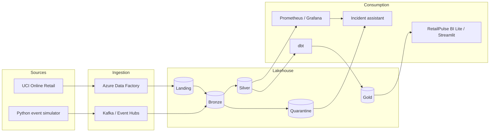
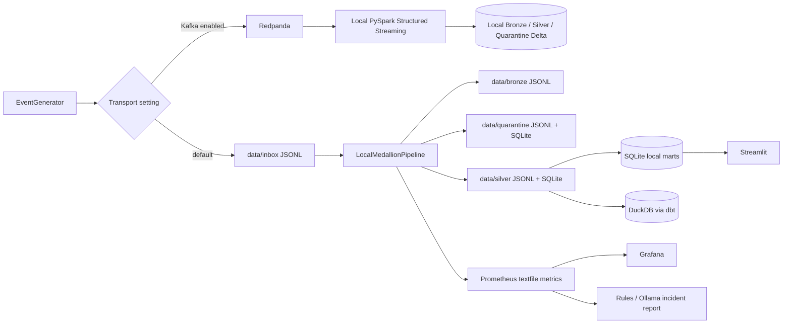
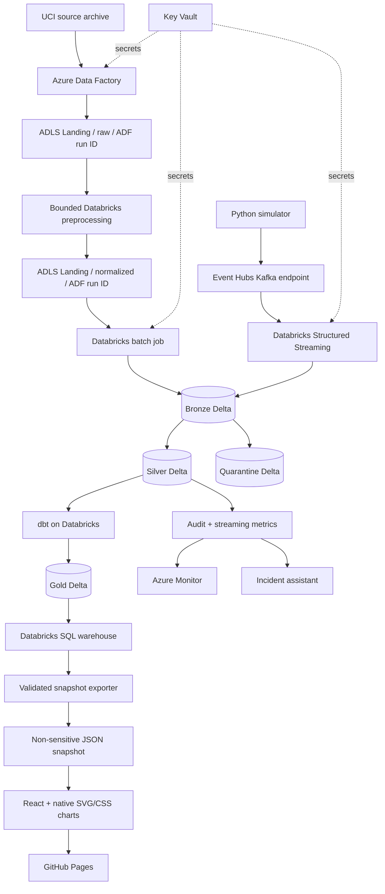
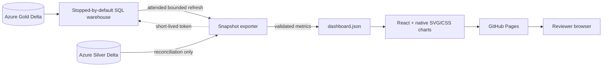
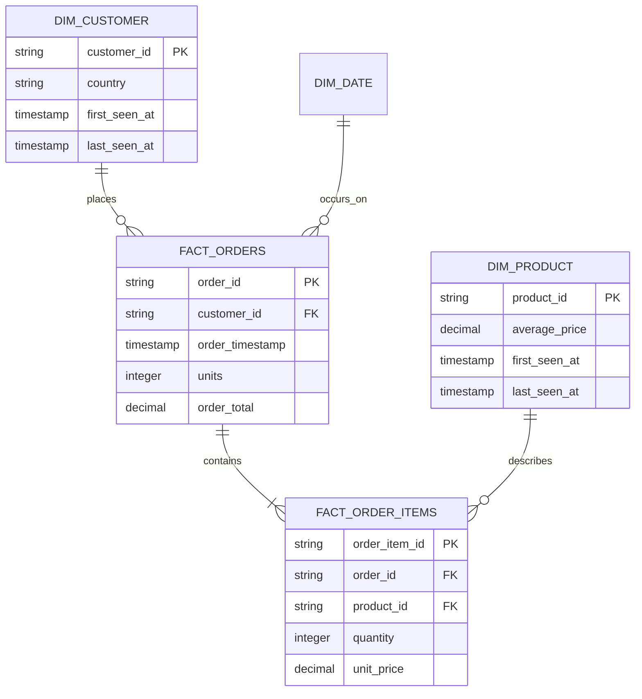

# RetailPulse architecture

Last reviewed: 2026-10-04

## 1. System context

RetailPulse combines a historical retail source with continuously generated customer, order, and
inventory activity. The system converts both paths into governed Silver data, builds business
marts, and exposes the same operational facts to monitoring and incident analysis.

## 2. Deployment views

### Local reference deployment

The local path is optimized for reproducibility and fast failure demonstrations.

The file-backed transport remains the fast deterministic test adapter with transactional offsets
and input-prefix hashes. Redpanda also feeds a local PySpark/Delta path for development of lateness,
checkpointing, and MERGE behavior before a short Azure integration run.

SQLite commits raw input, classifications, topic offsets, and the committed audit together.
Its Silver event-ID primary key provides deduplication. JSONL and checkpoint files are atomic
derived exports, repaired on a later run after process loss. Decimal price text and search
queries survive legacy migrations; old raw history/checkpoints are imported once transactionally.
dbt reads the committed Silver export, in an isolated DuckDB file during the complete demo.

### Azure target deployment

Terraform defines the Azure service boundary and scoped identity roles. It does not start
billable clusters or deploy application jobs automatically.

### BI publication boundary

RetailPulse BI Lite is a static-first public dashboard. Its attended refresh process queries Azure
Gold through a short-lived Azure Databricks token, validates Silver/Gold reconciliation, and
atomically replaces a non-sensitive JSON snapshot. GitHub Pages serves the React application and
snapshot; it never receives a Databricks credential and cannot issue arbitrary warehouse queries.

The warehouse is stopped in cleanup even when export or validation fails. A public page view does
not wake Databricks, so anonymous traffic cannot consume Azure credits. Snapshot metadata includes
the source catalog/schema, business window, generation time, freshness, and reconciliation state,
but excludes credentials and raw customer-level records.

## 3. Event flow

1. The generator creates a strict version 1 event with a stable UUID and timezone-aware event time.
2. Topic routing is determined only by event type.
3. Bronze stores the raw payload and transport/ingestion metadata before validation.
4. Parsing applies the explicit event schema and business rules.
5. Malformed records enter quarantine with the raw payload and validation reason.
6. Records more than 30 minutes older than ingestion time are explicitly retained as late.
7. Duplicate `event_id` values are removed before Silver insertion or Delta MERGE.
8. SQLite source offsets commit with classifications; exported checkpoint files are backups.
9. Audit and metric outputs describe the run without depending on business marts.
10. dbt consumes Silver data and materializes tested dimensions, facts, and aggregates.

## 4. Medallion contracts

| Layer | Purpose | Mutation policy | Primary metadata |
|---|---|---|---|
| Landing | Preserve delivered historical files | Append/new delivery | source path and delivery context |
| Bronze | Replayable raw system of record | Append-only | raw payload, source topic/file, ingestion time, run ID, Kafka coordinates in cloud |
| Silver | Validated, typed, deduplicated events/entities | Idempotent upsert by business/event key | event time, ingestion time, source, run ID |
| Quarantine | Retain non-conforming or late input | Append-only until governed replay | raw payload, error type/message, event ID, timestamp |
| Gold | Consumer-oriented dimensions, facts, and aggregates | Rebuild/incremental model policy | lineage from dbt manifest and tests |

## 5. Gold model

The product snapshot supplies SCD Type 2 history for price changes. `daily_sales`, `customer_360`,
and `inventory_health` are consumer marts built on the core model.

## 6. Reliability invariants

- Bronze data is never silently discarded because Silver rejects it.
- Silver contains at most one row per `event_id`.
- A normal retry cannot create a second Silver database row for a previously processed event.
- Event-time decisions use timezone-aware UTC values.
- A checkpoint is unique to one query and one logical source.
- A bad record is observable through quarantine and run metrics.
- Incident reports are derived from recorded telemetry; model output is advisory.
- Secrets and deployment-specific account names do not belong in committed source.

## 7. Architecture decisions

| Decision | Reason | Consequence |
|---|---|---|
| Three topics only | Keeps the first streaming topology understandable | Event type, not topic count, carries most semantic detail |
| Strict v1 JSON contract | Surfaces drift instead of silently ignoring fields | Producers must coordinate contract changes |
| File-backed local adapter | Makes tests deterministic and removes cloud prerequisites | It validates pipeline semantics, not Kafka transport behavior |
| Event ID as idempotency key | Stable across retries and simple to audit | Producers must reuse the ID when retrying the same event |
| Thirty-minute lateness policy | Makes late input observable without silent eviction | Older events require a governed replay path |
| SQLite/JSONL reference plus local Delta | Fast tests and Spark semantics are both available without Azure | Neither reproduces Azure identity or cloud performance |
| Local Delta development plus bounded Azure proof | Most Spark debugging is free while Azure evidence remains truthful | Local storage cannot prove Event Hubs, ADLS, identity, or Azure recovery |
| Event Hubs opt-in | Its Standard namespace has an idle hourly charge | Enable only for Stage 7 and disable after evidence capture |
| `AvailableNow` default | Processes queued data and terminates compute | Continuous mode is reserved for a maximum 30-minute recovery demo |
| Rules before LLM | Incident detection remains testable and available offline | AI enriches explanations but never defines data validity |
| No automatic Terraform apply | Avoids accidental Azure spend and destructive changes | Deployment requires an explicit operator action |

## 8. Security and operational boundaries

- `.env`, Terraform state/variables, tokens, keys, and connection strings are ignored by Git.
- Key Vault is the target secret boundary; Terraform manages roles and names but never secret
  values.
- ADF uses its system identity; Databricks uses a dedicated Access Connector managed identity.
  Both receive data access only at the RetailPulse filesystem scope.
- The Access Connector additionally receives Storage Blob Delegator at the storage-account scope;
  this permits Unity Catalog to request short-lived delegation keys without granting data access to
  other containers.
- Unity Catalog storage credentials and external locations govern Databricks access to ADLS.
- The demo uses local generated retail behavior and does not require customer PII.
- Automatic remediation is prohibited in the first release.
- Generated local state under `data/` is disposable; Azure state is not touched by the reset CLI.
- Source progress and classification are one SQLite transaction; all files are replaceable
  materializations. Subprocess exits before/after commit verify replay, audit recovery, and
  quarantine without duplicates. The local deployment assumes one attended writer and completed
  inbox deliveries; filesystem exports are not a distributed transaction.
- Python/Spark contract parity is exercised on real isolated workers and Delta checkpoints,
  including non-UTC executor OS timezone. Azure deployment/identity remains a separate proof.
- Incremental dbt rereads tied boundary timestamps and excludes unchanged rows. Item-only changes
  recompute order totals. Arrivals backdated before the ingestion boundary require full refresh.
