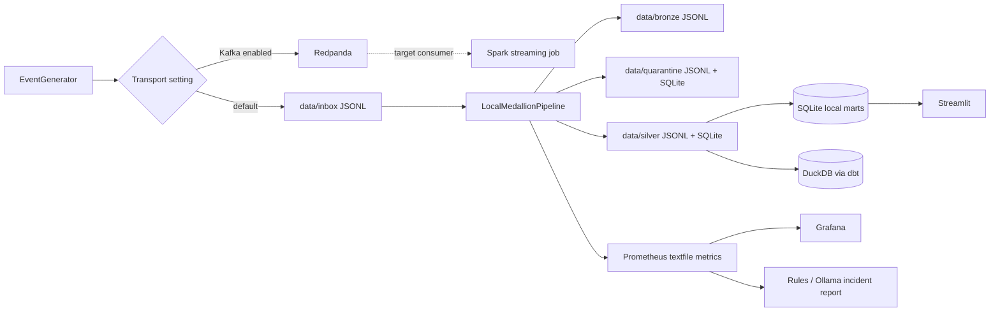
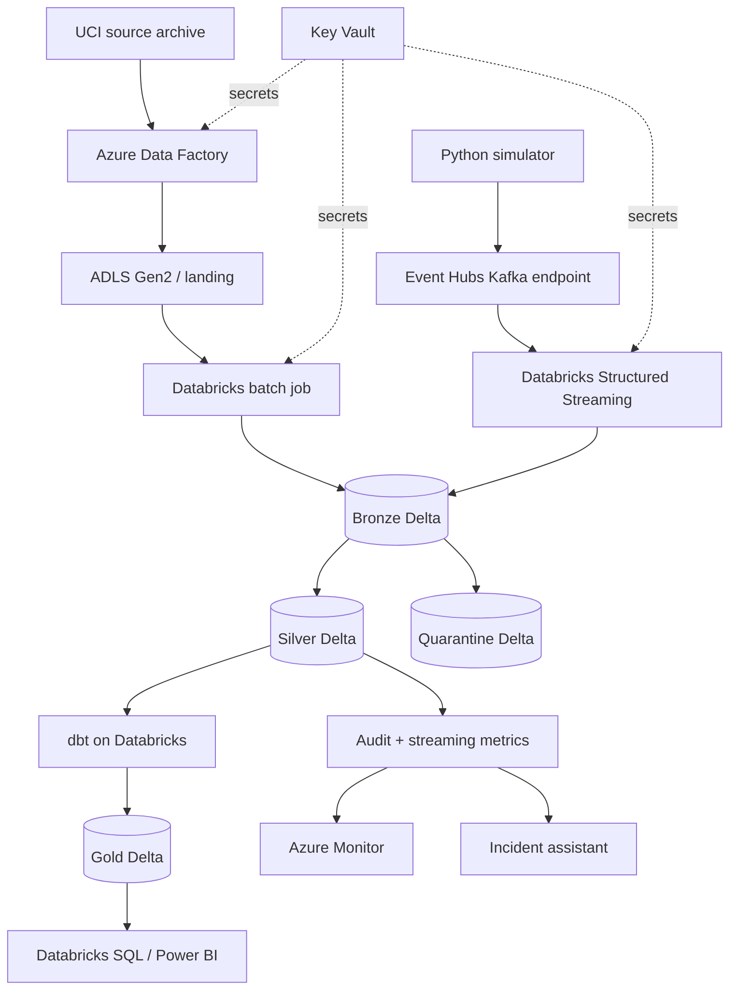
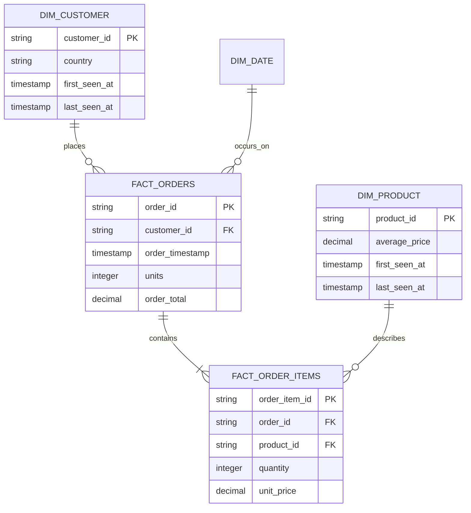

# RetailPulse architecture

Last reviewed: 2026-08-12

## 1. System context

RetailPulse combines a historical retail source with continuously generated customer, order, and
inventory activity. The system converts both paths into governed Silver data, builds business
marts, and exposes the same operational facts to monitoring and incident analysis.

## 2. Deployment views

### Local reference deployment

The local path is optimized for reproducibility and fast failure demonstrations.

The file-backed transport is intentionally not presented as Kafka. It is a deterministic local
test adapter with durable line-number checkpoints. Redpanda exercises Kafka-compatible publishing;
the production consumer implementation lives in the Databricks streaming job.

### Azure target deployment

Terraform defines the Azure service boundary. It deliberately does not start billable clusters,
apply role assignments without an identity decision, or deploy application jobs automatically.

## 3. Event flow

1. The generator creates a strict version 1 event with a stable UUID and timezone-aware event time.
2. Topic routing is determined only by event type.
3. Bronze stores the raw payload and transport/ingestion metadata before validation.
4. Parsing applies the explicit event schema and business rules.
5. Malformed records enter quarantine with the raw payload and validation reason.
6. Records older than the 30-minute watermark are treated as late and retained in quarantine.
7. Duplicate `event_id` values are removed before Silver insertion or Delta MERGE.
8. Checkpoints advance only after the corresponding input range has been processed.
9. Audit and metric outputs describe the run without depending on business marts.
10. dbt consumes Silver data and materializes tested dimensions, facts, and aggregates.

## 4. Medallion contracts

| Layer | Purpose | Mutation policy | Primary metadata |
|---|---|---|---|
| Landing | Preserve delivered historical files | Append/new delivery | source path and delivery context |
| Bronze | Replayable raw system of record | Append-only | raw payload, source topic/file, ingestion time, run ID, Kafka coordinates in cloud |
| Silver | Validated, typed, deduplicated events/entities | Idempotent upsert by business/event key | event time, ingestion time, source, run ID |
| Quarantine | Retain non-conforming or late input | Append-only until governed replay | raw payload, error type/message, event ID, timestamp |
| Gold | Consumer-oriented dimensions, facts, and aggregates | Rebuild/incremental model policy | lineage from dbt manifest and tests |

## 5. Gold model

The product snapshot supplies SCD Type 2 history for price changes. `daily_sales`, `customer_360`,
and `inventory_health` are consumer marts built on the core model.

## 6. Reliability invariants

- Bronze data is never silently discarded because Silver rejects it.
- Silver contains at most one row per `event_id`.
- A normal retry cannot create a second Silver database row for a previously processed event.
- Event-time decisions use timezone-aware UTC values.
- A checkpoint is unique to one query and one logical source.
- A bad record is observable through quarantine and run metrics.
- Incident reports are derived from recorded telemetry; model output is advisory.
- Secrets and deployment-specific account names do not belong in committed source.

## 7. Architecture decisions

| Decision | Reason | Consequence |
|---|---|---|
| Three topics only | Keeps the first streaming topology understandable | Event type, not topic count, carries most semantic detail |
| Strict v1 JSON contract | Surfaces drift instead of silently ignoring fields | Producers must coordinate contract changes |
| File-backed local adapter | Makes tests deterministic and removes cloud prerequisites | It validates pipeline semantics, not Kafka transport behavior |
| Event ID as idempotency key | Stable across retries and simple to audit | Producers must reuse the ID when retrying the same event |
| Thirty-minute watermark | Demonstrates bounded event-time state | Older events require a governed replay path |
| SQLite/JSONL locally, Delta in Azure | Fast local setup with a realistic cloud target | Performance characteristics are not equivalent |
| Rules before LLM | Incident detection remains testable and available offline | AI enriches explanations but never defines data validity |
| No automatic Terraform apply | Avoids accidental Azure spend and destructive changes | Deployment requires an explicit operator action |

## 8. Security and operational boundaries

- `.env`, Terraform state/variables, tokens, keys, and connection strings are ignored by Git.
- Key Vault exists as the target secret boundary, but role assignments require deployment-specific
  principals and are not guessed by the template.
- The demo uses local generated retail behavior and does not require customer PII.
- Automatic remediation is prohibited in the first release.
- Generated local state under `data/` is disposable; Azure state is not touched by the reset CLI.
- The local checkpoint file and SQLite transaction are separate durability mechanisms. The normal
  restart path is tested, but abrupt process-loss fault injection is still required before claiming
  atomic exactly-once behavior for the local adapter. Delta checkpoints are the production design.
