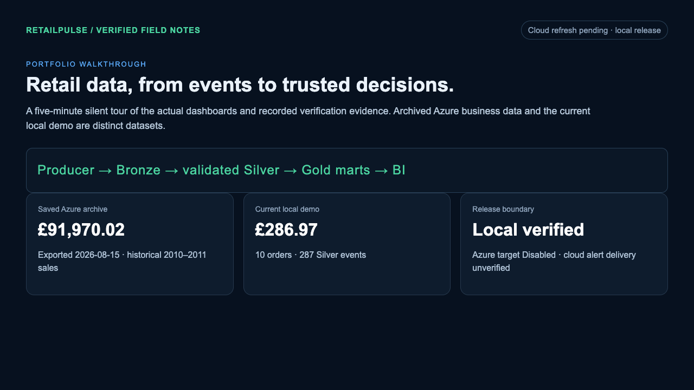

# RetailPulse portfolio walkthrough

[Watch or download the guided MP4](assets/retailpulse-walkthrough.mp4).

[](assets/retailpulse-walkthrough.mp4)

**Recorded artifact:** 5 minutes 11.5 seconds · 1280 × 720 · H.264 at 8 fps · 1.84 MB.
[Media verification](evidence/walkthrough-media.json) records the decode and playback checks.

This silent, captioned recording demonstrates the local release. It visits the actual production
BI dashboard and running Streamlit app, then shows selected aggregate verification evidence. The
saved Azure snapshot, current local demo, and pending cloud verification are labeled separately.

The Azure archive was exported **15 August 2026** and covers business dates **2010–2011**. Its
**£91,970.02 / 1,796 orders** are not current local figures. The recorded local dashboard shows
**£286.97 / 10 orders / 287 Silver events**, with business date **4 October 2026**. The isolated
baseline evidence covers **295 Bronze / 266 Silver / 10 quarantine**; a later monitoring scenario
added the extra accepted demo events visible in Streamlit.

## Tour chapters

Each phase lasts about 28 seconds. Navigation adds a few seconds to these approximate starts.

| Approximate start | Screen | What to look for |
|---|---|---|
| 0:00 | Scope and architecture | Producer → Bronze → Silver → Gold → BI; archived and local datasets |
| 0:28 | BI Overview | Archive age, historical business window, revenue and event-ratio labels |
| 0:56 | BI Commerce | Daily revenue, countries, product value, anonymous customer rankings |
| 1:24 | BI Freshness | Status measured at export, stopped-stream context, five reconciliation checks |
| 1:52 | Local Streamlit metrics | Current demo revenue/orders, processing dates, independent event ratio |
| 2:20 | Local commerce charts | Product and customer value; penny-rounding consistency |
| 2:48 | Local operational tables | Inventory updates and pipeline classifications, including empty reruns |
| 3:16 | Recorded scenario evidence | Normal, duplicate, malformed, late-data, and traffic-spike results |
| 3:44 | dbt evidence | Clean, incremental, full refresh, unchanged rerun, and equivalence checks |
| 4:12 | Local monitoring evidence | Prometheus targets UP, Grafana health, fired alert and recovery |
| 4:40 | Cloud boundary | Disabled Azure target, missing cloud alert rule, unverified delivery |

Purchase/view ratio uses independently sampled demo events. It is not customer conversion and may
exceed 100%. No new Azure extraction, paid compute run, or cloud notification delivery is claimed
by this recording.

## Reproduce the recording

Start the production BI preview and a populated local Streamlit dashboard first. Install the
frontend dependencies and Playwright Chromium if they are not already available. From the
repository root, use two terminals for the UI processes:

```bash
npm --prefix bi-dashboard run build
npm --prefix bi-dashboard run preview -- --host 127.0.0.1 --port 4173 --strictPort
```

```bash
RETAILPULSE_DATA_DIR=/tmp/retailpulse-demo .venv313/bin/streamlit run dashboard/app.py --server.address 127.0.0.1
```

The recording script requires the three verification JSON files under `docs/evidence/`, a local
Python environment, Playwright Chromium, and `ffmpeg` with H.264 encoding. Point it at the same
SQLite data directory used by Streamlit:

```bash
RETAILPULSE_RECORD_DATA_DIR=/tmp/retailpulse-demo node bi-dashboard/scripts/record-walkthrough.mjs
```

The script reads only aggregate SQLite counts/totals and an explicit set of evidence fields. It
records temporary WebM under the system temporary directory, writes the H.264 MP4 at
`docs/assets/retailpulse-walkthrough.mp4`, and writes a poster beside it. It never reads credential
files or queries Azure.

Useful overrides are `RETAILPULSE_BI_URL`, `RETAILPULSE_STREAMLIT_URL`,
`PLAYWRIGHT_CHROMIUM_EXECUTABLE_PATH` for a compatible cached browser,
`RETAILPULSE_WALKTHROUGH_OUTPUT`, and `RETAILPULSE_PYTHON_BIN`. Default phase duration is 28 seconds;
`RETAILPULSE_WALKTHROUGH_PHASE_SECONDS` can shorten a local smoke check.

See [browser evidence](evidence/stage-09-bi-dashboard.md) and the
[Stage 9 runbook](runbooks/stage-09-bi-dashboard.md) for validation and bounded refresh controls.
